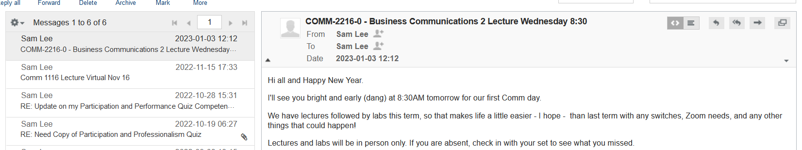
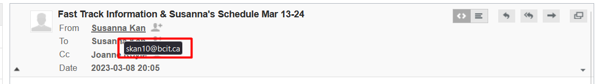
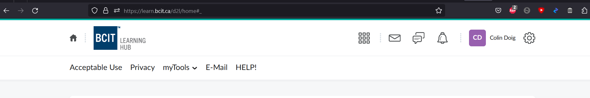
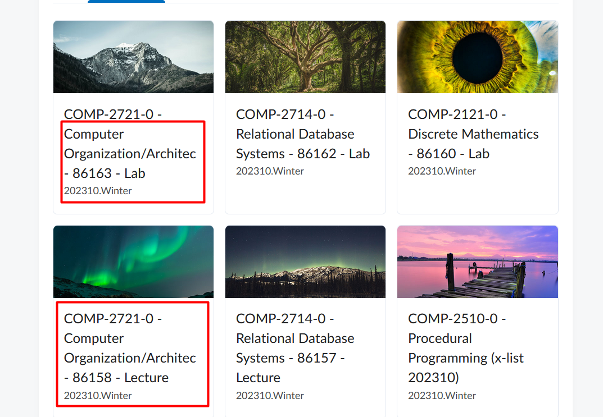
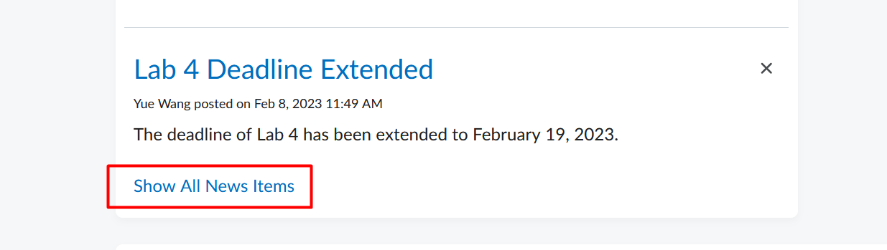
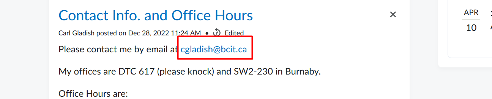
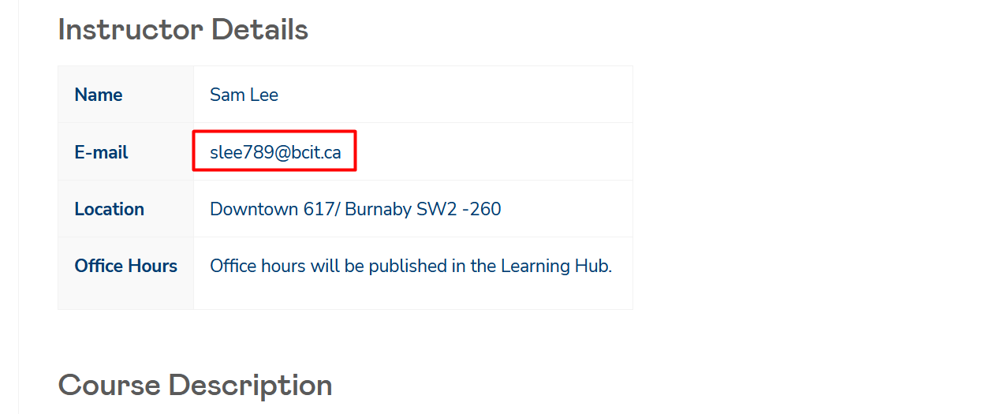
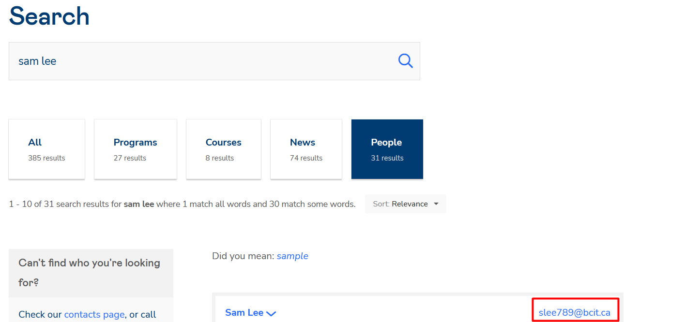
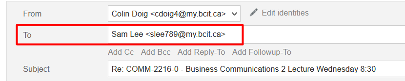

# Replying to BCIT Instructor Emails

## Overview

This section will instruct you on how to reply to your BCIT instructor's email correctly! While it may sound simple, the email that instructors send from is often different from the one that we students receive. Using this guide should make this process much easier for you.

## Locating the Email to Reply to

1. Login to your myBCIT email.
 See detailed instructions in steps 1 and 2 in forwarding email for more instructions if necessary.

2. Locate the email from the instructor you wish to reply to.

3. Check the email address in the **From** box.  
 If it looks similar to this:  you *should* be good to reply. If it doesn't look like this or the reply bounces back, proceed to the next section.  
 *Make sure to leave this tab open on the email that you wish to reply to.*

## Locating the Correct Email Address

1. Navigate and login to your LearningHub in a separate tab.

 You should be logged in already after having logged into myBCIT. If not, enter your login credentials again.

2. Navigate to the instructor's course page.  
 Note that some instructor's may have both a Lecture AND Lab page, you will have to check both in the next step if that's the case.
 

3. Check the Course Home page to see if the instructor's email has been posted there.  
 Don't forget to check both Lecture AND Lab pages if they exist  
 If it is later in the semester you may have to click Show All News Items towards the bottom of the page to locate the post containing it
 
 If the instructor's email *IS* present, move to step 6
 
 If the instructor's email is *NOT* present, continue to the next step

4. Check the **Course Outline** for the course to see if the instructor's email has been included.  
 Note that some instructor's do not post their course outlines on their course page. In this case [follow this link](https://www.bcit.ca/outlines/) and search for the correct course.  
 If the instructor's email *IS* present, move to step 6  
 
 If the instructor's email is *NOT* present, continue to the next step

5. Access the [**BCIT Faculty Directory**](https://www.bcit.ca/contacts/) and search for the instructor's contact information.

6. Copy the email address and navigate back to your myBCIT email tab.

## Sending the Reply

1. Click Reply and Paste the correct email address into the **To** box.

2. Write your message and click send!

## Conclusion

You now know how to locate your instructor's email addresses so that you can send or reply to emails from them without confusion!
